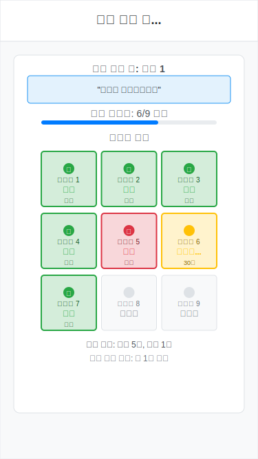

# Mira 합의메커니즘 웹앱 - UI/UX 와이어프레임 설계

## 📋 개요

이 문서는 Mira 합의메커니즘 웹앱의 UI/UX 설계를 위한 와이어프레임을 제공합니다. 사용자 중심의 직관적 인터페이스 설계를 목표로 하며, 모바일 우선(Mobile First) 접근 방식을 채택합니다.

## 🎯 설계 원칙

### 핵심 가치

- **직관성**: 첫 사용자도 가이드 없이 이용 가능
- **투명성**: 검증 과정의 실시간 시각화
- **효율성**: 평균 2분 내 전체 과정 완료
- **접근성**: 모바일/데스크톱 완벽 호환

### 디자인 시스템

- **컬러**: 사실(#28a745), 거짓(#dc3545), 진행중(#ffc107), 대기(#6c757d)
- **타이포그래피**: Arial, 명확한 계층 구조
- **스페이싱**: 일관된 8px 그리드 시스템
- **애니메이션**: 부드러운 상태 전환, 로딩 피드백

## 📱 화면별 와이어프레임

### 1. 랜딩/질문 입력 화면

**목적**: 사용자의 첫 진입점, 서비스 이해와 질문 입력


**주요 구성 요소:**

- **헤더**: 서비스 브랜딩 "Mira 합의메커니즘"
- **메인 헤드라인**: "AI 답변을 9명이 검증해요!" - 서비스 핵심 가치 전달
- **설명 텍스트**: 간단명료한 서비스 소개
- **예시 질문 버튼**:
  - "토끼에 대해 알려줘" (파란색 - 일반적 질문)
  - "지구는 평평한가요?" (녹색 - 논란적 질문)
  - "인공지능이 위험한가요?" (주황색 - 복합적 질문)
- **직접 입력창**: 사용자 맞춤 질문 입력
- **CTA 버튼**: "검증 시작하기" - 명확한 행동 유도
- **하단 안내**: 모바일 지원, 소요 시간 정보

**UX 고려사항:**

- 예시 질문으로 진입 장벽 낮춤
- 색상 코딩으로 질문 유형 구분
- 명확한 기대치 설정 (2분 소요)

### 2. AI 답변 생성 화면

**목적**: 답변 생성 과정의 투명한 시각화, 사용자 대기 경험 개선


**주요 구성 요소:**

- **헤더**: "답변 생성 중..." 현재 상태 명시
- **질문 표시**: 입력된 질문 재확인
- **로딩 애니메이션**: 회전하는 원형 인디케이터
- **상태 메시지**: "GPT가 답변을 생성하고 있어요"
- **진행률 바**: 70% 완료, 예상 시간 표시
- **단계 인디케이터**: 4단계 중 현재 위치 표시
  - 답변생성 (활성) → 명제분할 → 검증 → 결과
- **취소 버튼**: 사용자 제어권 보장

**UX 고려사항:**

- 구체적 진행률과 예상 시간으로 불안감 해소
- 단계별 프로세스 명시로 예측 가능성 제공
- 취소 옵션으로 사용자 제어권 보장

### 3. 명제 분할 화면

**목적**: AI 답변의 명제 분할 과정 시각화, 검증 단위 이해 제공


**주요 구성 요소:**

- **헤더**: "명제 분할 완료" 단계 완료 알림
- **제목**: "답변을 검증 가능한 문장으로 나눴어요"
- **원본 답변 박스**: 회색 배경으로 원본 표시
- **화살표**: 분할 과정의 시각적 표현
- **분할된 명제들**: 색상별 구분
  - 명제 1: 파란색 "토끼는 포유동물이다"
  - 명제 2: 녹색 "토끼는 빠르게 달릴 수 있다"
  - 명제 3: 주황색 "토끼는 긴 귀와 짧은 꼬리를 가진다"
  - 명제 4: 보라색 "토끼는 주로 풀을 먹고 굴을 판다"
- **계속하기 버튼**: "검증 시작하기"

**UX 고려사항:**

- 원본 → 분할 과정의 명확한 시각화
- 각 명제별 색상 구분으로 추적 용이성
- 명제 개수 표시 (4개)로 예상 가능성 제공

### 4. 검증 과정 화면 (3x3 그리드)

**목적**: 실시간 검증 과정의 투명한 시각화, 합의메커니즘 체험



**주요 구성 요소:**

- **헤더**: "검증 진행 중..." 현재 상태
- **현재 명제**: 검증 중인 명제 강조 표시
- **진행률**: "6/9 완료" 숫자와 바 형태
- **3x3 검증자 그리드**:
  - 완료(사실): 녹색 배경, 체크 아이콘, "사실" 텍스트
  - 완료(거짓): 빨간색 배경, X 아이콘, "거짓" 텍스트
  - 검증중: 노란색 배경, 애니메이션, "검증중..." + 시간
  - 대기중: 회색 배경, "대기중" 텍스트
- **실시간 결과**: "현재 결과: 사실 5표, 거짓 1표"
- **예상 시간**: "약 1분 남음"

**UX 고려사항:**

- 실시간 상태 업데이트로 투명성 제공
- 색상과 아이콘으로 직관적 이해
- 현재 결과 표시로 진행 상황 파악
- 예상 완료 시간으로 기대치 관리

### 5. 최종 결과 화면

**목적**: 검증 결과의 명확한 전달, 재사용 유도


**주요 구성 요소:**

- **헤더**: "검증 완료!" 성공 메시지
- **전체 요약 박스**: 녹색 배경
  - "4개 명제 중 3개 사실, 1개 거짓"
  - 평균 검증 시간, 합의율 표시
- **명제별 상세 결과**:
  - 명제 1-3: 녹색 배경, "✓ 사실 (X/9표)"
  - 명제 4: 빨간색 배경, "✗ 거짓 (X/9표)"
  - 각 명제별 투표 분포 표시
- **원본 AI 답변**: 회색 박스로 재표시
- **액션 버튼들**:
  - "다시 해보기": 파란색, 재사용 유도
  - "공유하기": 흰색 테두리, 확산 유도

**UX 고려사항:**

- 계층적 정보 구조 (요약 → 상세 → 원본)
- 명확한 결과 표시 (사실/거짓, 투표수)
- 재사용과 공유 옵션 제공
- 성취감을 주는 완료 메시지

## 📏 반응형 설계 가이드라인

### 모바일 (375px 기준)

- **터치 영역**: 최소 44px 이상
- **폰트 크기**: 본문 14px, 제목 16-24px
- **여백**: 좌우 20px, 요소간 16px
- **버튼**: 전체 너비, 50px 높이

### 태블릿 (768px 이상)

- **그리드**: 중앙 정렬, 최대 600px 너비
- **검증자 그리드**: 간격 확대 (100px → 120px)
- **폰트 크기**: 1.2배 확대

### 데스크톱 (1024px 이상)

- **레이아웃**: 2컬럼 가능 (진행상황 + 세부내용)
- **검증자 그리드**: 간격 추가 확대 (120px → 150px)
- **호버 효과**: 버튼, 검증자 박스에 hover 상태

## 🎨 상태별 스타일 가이드

### 색상 시스템

```css
/* 성공/사실 */
--success-bg: #d4edda
--success-border: #28a745
--success-text: #155724

/* 실패/거짓 */
--danger-bg: #f8d7da
--danger-border: #dc3545
--danger-text: #721c24

/* 진행중 */
--warning-bg: #fff3cd
--warning-border: #ffc107
--warning-text: #856404

/* 대기/비활성 */
--secondary-bg: #f8f9fa
--secondary-border: #dee2e6
--secondary-text: #6c757d
```

### 애니메이션 가이드

- **로딩**: 1초 주기 회전 애니메이션
- **진행률 바**: 0.3초 ease-out 전환
- **검증자 상태**: 0.5초 fade-in 효과
- **페이지 전환**: 0.2초 slide 애니메이션

## ✅ 접근성 체크리스트

- [ ] **색상 대비**: WCAG 2.1 AA 기준 준수
- [ ] **키보드 내비게이션**: Tab 순서 논리적 구성
- [ ] **스크린 리더**: alt 텍스트, aria-label 추가
- [ ] **포커스 표시**: 명확한 focus outline
- [ ] **에러 메시지**: 구체적이고 실행 가능한 안내

## 🔧 구현 우선순위

### Phase 1: MVP (2주)

1. 랜딩 화면 - 기본 레이아웃
2. AI 생성 화면 - 로딩 상태
3. 결과 화면 - 기본 표시

### Phase 2: 핵심 기능 (3주)

4. 명제 분할 화면 - 시각화
5. 검증 과정 화면 - 3x3 그리드

### Phase 3: 최적화 (2주)

6. 반응형 최적화
7. 애니메이션 개선
8. 접근성 강화

이 와이어프레임은 개발 과정에서 지속적으로 사용자 피드백을 받아 개선될 예정입니다.
